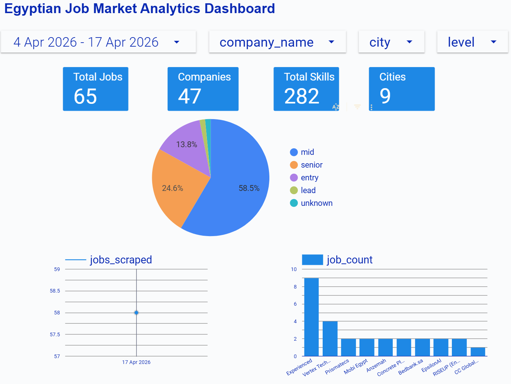

# 🇪🇬 Egyptian Job Market Analytics Pipeline

> An end-to-end data engineering pipeline that scrapes, processes, and visualises tech job listings from [Wuzzuf.net](https://wuzzuf.net) — Egypt's leading job platform.

[](https://python.org)
[](https://airflow.apache.org)
[](https://kafka.apache.org)
[](https://postgresql.org)
[](https://datastudio.google.com/s/jIGbjWwMk2Q)
[](https://docker.com)

---

## 📊 Live Dashboard

**[View the interactive dashboard →](https://datastudio.google.com/s/jIGbjWwMk2Q)**



---

## 🏗️ Architecture

```
Wuzzuf.net
    │
    ▼
┌─────────────────┐
│  Playwright      │  ← Web scraper (Chromium, headless)
│  Scraper         │
└────────┬────────┘
         │  Raw JSON
         ▼
┌─────────────────┐
│  Validator       │  ← Quality checks before ingestion
└────────┬────────┘
         │
         ▼
┌─────────────────┐
│  Kafka Producer  │  ← Publishes job events to topic
│  (wuzzuf_raw_jobs) │
└────────┬────────┘
         │  Kafka Messages
         ▼
┌─────────────────┐
│  Kafka Consumer  │  ← Cleans, normalises, upserts
│  → data/staging/ │
└────────┬────────┘
         │  Cleaned JSON
         ▼
┌─────────────────┐
│  PostgreSQL      │  ← Star schema warehouse (Neon)
│  Star Schema     │
└────────┬────────┘
         │
         ▼
┌─────────────────┐
│  Looker Studio   │  ← Interactive dashboard
└─────────────────┘

All steps orchestrated by Apache Airflow (daily @ 08:00 Cairo time)
```

---

## ✨ Features

- **Resilient scraper** — Playwright-based, survives Wuzzuf's CSS-in-JS class churn with structural selectors and heuristic fallbacks
- **Graceful degradation** — automatic fallback to mock data generator when Wuzzuf is unreachable (CI/offline friendly)
- **Kafka streaming** — job events published with gzip compression, `acks=all` reliability settings
- **Incremental staging** — one fixed file per keyword; new job IDs are appended, existing ones updated in-place (idempotent)
- **Star schema warehouse** — fact table + 5 dimensions + bridge table for skills many-to-many
- **Airflow orchestration** — daily DAG with XCom handoffs, retry logic, and an `all_done` summary task
- **Quality validation** — field completeness checks before any data enters the pipeline

---

## 📁 Project Structure

```
.
├── airflow/
│   ├── dags/
│   │   └── job_pipeline_dag.py      # Main Airflow DAG
│   ├── .env                          # Airflow environment config
│   └── .dockerignore
├── scraper/
│   ├── wuzzuf_scraper.py             # Playwright scraper
│   ├── mock_data_generator.py        # Offline/CI mock data
│   └── validator.py                  # Raw data quality checks
├── Kafka/
│   ├── producer.py                   # Publishes jobs to Kafka topic
│   └── consumer.py                   # Consumes, cleans, stages jobs
├── warehouse/
│   ├── schema.sql                    # Star schema DDL + views
│   └── loader.py                     # Staging → PostgreSQL loader
├── data/
│   ├── raw/                          # Scraped JSON (one file per keyword)
│   └── staging/                      # Cleaned JSON (incremental upsert)
├── dashboard/
│   └── Dashboard Link.txt
├── config/
│   └── .env                          # DB credentials (not committed)
├── docker-compose.yml                # Full stack: Airflow + Kafka + Postgres
├── Dockerfile                        # Custom Airflow image with Playwright
└── requirements.txt
```

---

## 🗃️ Data Schema

### Star Schema

```
fact_job_postings
    ├── company_id      → dim_company
    ├── location_id     → dim_location
    ├── experience_id   → dim_experience
    ├── scraped_date_id → dim_date
    └── posting_id      → bridge_job_skill → dim_skill
```

### Job Fields

| Field | Description |
|---|---|
| `job_id` | Wuzzuf unique identifier |
| `title` | Job title |
| `company` | Hiring company |
| `location_city` | Normalised city |
| `job_type` | Full Time / Part Time / Freelance |
| `experience_label` | e.g. "3-7 years" |
| `skills` | List of skill tags |
| `days_ago` | Days since posted (parsed integer) |
| `keyword` | Search keyword used to find this job |

---

## 🚀 Getting Started

### Prerequisites

- Docker & Docker Compose
- Python 3.11+

### 1. Clone and configure

```bash
git clone https://github.com/your-username/egyptian-job-market-pipeline.git
cd egyptian-job-market-pipeline

cp config/.env.example config/.env
# Edit config/.env with your PostgreSQL credentials
```

### 2. Build and start

```bash
docker-compose build          # Build custom Airflow image (once)
docker-compose up airflow-init  # Initialise Airflow DB (once)
docker-compose up -d          # Start everything
```

Services available:
- **Airflow UI** → http://localhost:8080 (admin / admin)
- **Kafka UI** → http://localhost:8082
- **Kafka broker** → localhost:9092

### 3. Run the pipeline

Trigger the DAG from the Airflow UI, or run individual components:

```bash
# Scrape manually
python scraper/wuzzuf_scraper.py --keyword "data engineer" --max-pages 5

# Validate raw data
python scraper/validator.py --dir data/raw

# Produce to Kafka
python Kafka/producer.py --input-dir data/raw

# Consume and stage
python Kafka/consumer.py

# Load to warehouse
python warehouse/loader.py --init-schema
```

### 4. Generate mock data (offline)

```bash
python scraper/mock_data_generator.py
```

---

## 🔍 Keywords Tracked

| Keyword | Description |
|---|---|
| `data engineer` | ETL, pipelines, data infrastructure |
| `data analyst` | BI, reporting, visualisation |
| `machine learning` | ML, AI, data science |
| `backend developer` | APIs, frameworks, server-side |

---

## 📈 Dashboard Highlights

The Looker Studio dashboard covers the period **4 Apr – 17 Apr 2026** and shows:

- **65 total job postings** across 47 unique companies
- **282 distinct skill tags** across 9 cities
- **58.5% mid-level** roles, 24.6% senior, 13.8% entry
- Cairo dominates with **48 out of 65** postings
- Top companies: Vertex Technologies, Prismatecs, Mobi Egypt, Anzemah

**[Open Dashboard →](https://datastudio.google.com/s/jIGbjWwMk2Q)**

---

## 🛠️ Tech Stack

| Layer | Technology |
|---|---|
| Scraping | Python, Playwright (Chromium) |
| Orchestration | Apache Airflow 2.10.4 |
| Streaming | Apache Kafka (Confluent 7.6.0) |
| Storage | PostgreSQL 15 (Neon serverless) |
| Containerisation | Docker, Docker Compose |
| Visualisation | Google Looker Studio |
| Language | Python 3.11 |

---

## 📝 Notes

- The scraper uses **structural CSS selectors** (not hashed Emotion class names) to survive Wuzzuf's front-end deployments
- Run `python scraper/wuzzuf_scraper.py --debug-html <page.html>` to inspect selectors after a site update
- All staging and warehouse loads are **idempotent** — safe to re-run without creating duplicates

---

## 🤝 Contributing

Pull requests are welcome. For major changes, please open an issue first.

---

## 📄 License

MIT
